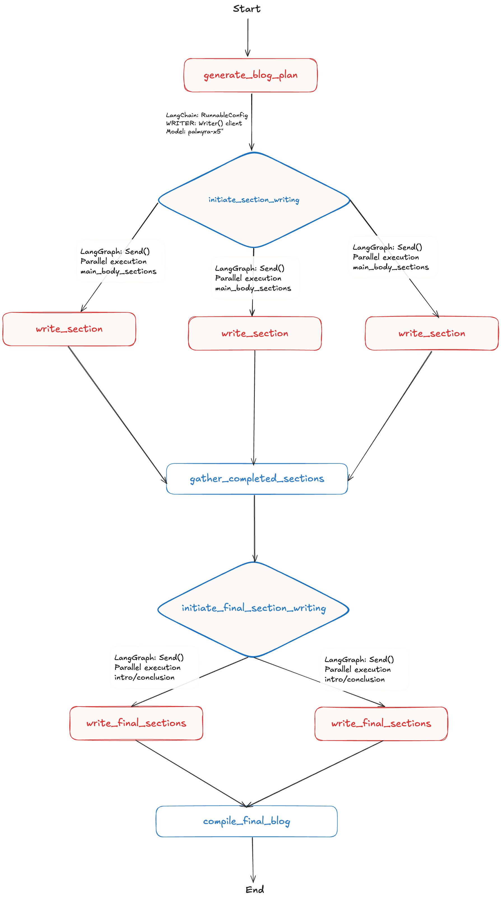

# Blog Generator: AI-Powered Content Creation with LangGraph and WRITER AI

## 🚀 Overview

Blog Generator is a sophisticated AI-powered content generation system that combines **LangGraph** for workflow orchestration with **WRITER AI** for intelligent content generation:

- **Plans blog structure** using WRITER's structured output capabilities to break down content into logical sections
- **Researches topics** by scraping provided URLs for additional context
- **Writes sections in parallel** using LangGraph's concurrent processing with WRITER's palmyra-x5 model
- **Compiles final content** into a complete, well-structured blog post
- **Leverages WRITER AI** for reliable, validated content generation with native structured output support

### Key Features

- **Intelligent Planning**: WRITER AI analyzes notes and creates structured blog outlines using native structured output
- **Web Research**: Automatically scrapes and incorporates information from provided URLs
- **Parallel Processing**: Multiple sections written simultaneously using LangGraph with WRITER's palmyra-x5 model
- **WRITER Integration**: Leverages WRITER AI's ChatWriter interface for reliable, validated content generation
- **Structured Output**: Uses WRITER's native structured output capabilities for consistent, well-formatted content
- **Configurable**: Customizable blog structure and requirements

## 📋 Prerequisites

- Python 3.11 or higher
- Poetry (for dependency management)
- WRITER API key (required)
- LangSmith API key (optional - for dashboard observability)

## 🔧 Installation & Setup

### 1. Clone and Navigate to Project
```bash
git clone https://github.com/adeweaver/LangChain-examples.git
cd LangChain-examples
```

### 2. Install Dependencies
```bash
poetry install
```

### 3. Set Up Environment Variables

#### Required: WRITER API Key
```bash
# Option A: Environment variable
export WRITER_API_KEY="your_WRITER_api_key_here"

# Option B: .env file (recommended)
cp .env.template .env
# Edit .env file with your WRITER API key
```

#### Optional: LangSmith API Key (for dashboard)
```bash
# Add to your .env file for dashboard observability:
LANGCHAIN_TRACING_V2=true
LANGCHAIN_API_KEY=your_langsmith_api_key_here
LANGCHAIN_PROJECT=blog-generator
```

## 🚀 Quick Start

### 1. Prepare Your Blog Content
Edit `src/notes/workflows.txt` with your blog topic:
```bash
# Example content for workflows.txt
I want to write a blog post about WRITER workflows

We get this question all the time at WRITER AI Framework

A workflow is a sequence of connected blocks, where each block performs a specific action. 
Think of it like a chain reaction - when one block completes its task, it triggers the next block in line.

WRITER Workflows is currently in beta, which means we're still actively improving features and adding functionality.

Workflows save time and effort by automating repetitive tasks.
```

### 2. Add Research URLs (Optional)
Edit `src/main.py` to add URLs for additional research context:
```python
input_data = BlogStateInput(
    transcribed_notes_file="workflows.txt",
    urls=[
        "https://dev.writer.com/home/introduction",
        "https://dev.writer.com/no-code/introduction"
        # Add your own research URLs here
    ])
```

### 3. Run the Blog Generator
```bash
poetry run python src/main.py
```

### 4. Find Your Generated Blog
The blog will be saved to `src/results/` with a timestamp:
```
src/results/blog_20241201_143022.md
```

## 🎯 How It Works



### Workflow Overview

1. **Blog Planning Phase**
   - Reads user notes from `src/notes/workflows.txt`
   - Uses AI to create structured blog outline
   - Defines sections (introduction, main body, conclusion)

2. **Research Phase**
   - Scrapes content from provided URLs
   - Extracts relevant information for each section

3. **Parallel Writing Phase**
   - Writes main body sections concurrently
   - Each section uses research data and user notes

4. **Final Assembly Phase**
   - Writes introduction and conclusion using completed sections as context
   - Compiles all sections into final blog post

**Happy Blogging! 🚀**